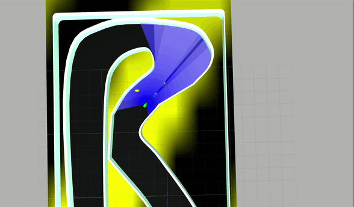
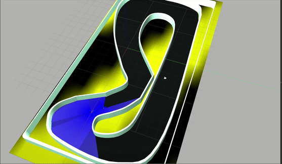
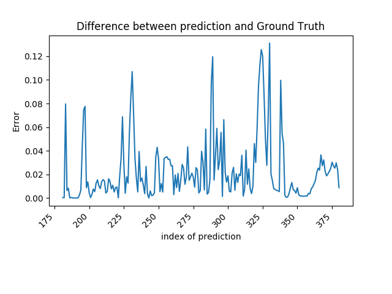

# F1Tenth: Platooning, Computer Vision, Reinforcement Learning, Path Planning


# Table of Contents

1. [Introduction](#introduction)
2. [Installation](#Installation)
3. [Platooning](#Platooning)
4. [Computer Vision](#ComputerVision)
5. [Reinforcement Learning](#ReinforcementLearning)
6. [Docker](#Docker)
7. [Developers](#Developers)


# Introduction <a name="introduction"></a>

Welcome! This repository contains a host of [ROS](http://wiki.ros.org/ROS/Introduction) packages for the [F1Tenth Autonomous Racing Competition](http://f1tenth.org/). In this repository you will find ROS packages designed for both simulation and the F1Tenth hardware platform. The simulation is based on a Gazebo based virtual racing environment. Our goal is to develop the F1Tenth platform for AI research to experiment with deep learning, computer vision, reinforcement learning, and path planning for autonomous racing.  

If you have any questions or run into any problems. Feel free to send me an [email](mailto:patrick.musau@vanderbilt.edu) or to post an issue and I'll do my best to get back to you promptly.



# Installation <a name="Installation"></a>

### Install Necessary Environments
 
 This interactive script will set up cuda (you'll need to download cuda 9.2 and cudnn7.6 (9.2), build opencv with cuda bindings for both python2.7 and 3.6, create two anaconda environments, and install ros-kinetic. This is your best choice for a fresh ubuntu16.04 install. Not tested with ubuntu18. 

`chmod +x setup_cuda_ros_opencv_conda.sh`
`./setup_cuda_ros_opencv_conda.sh`

The computer vision packages assume your system is GPU enabled. If your system is not gpu enabled, change the requirements in [setup.sh](setup.sh) to requirements-cpu.txt.

### Install the Repo

If you already have these environments set up, then go with this choice. We assume that you have ROS Kinetic and Gazebo installed. If not please installed these packages using the following link: [Install ROS-Kinetic](http://wiki.ros.org/kinetic/Installation/Ubuntu).

Once you have ROS-Kinetic installed. Run the following commands:

```bash
$ source /opt/ros/kinetic/setup.bash
$ git clone https://github.com/pmusau17/Platooning-F1Tenth
$ cd Platooning-F1Tenth
```
After everything has been cloned in to Platooning-F1Tenth Run:

```bash 
$ chmod u+x setup.bash
$ ./setup.sh
$ catkin_make
$ source devel/setup.bash
```
### Troubleshooting 

If you get the error: ImportError: No module named catkin_pkg.packages and you are using anaconda. Run the following command: ```conda install -c auto catkin_pkg```

# Platooning Algorithms<a name="Platooning"></a>
 
 **Disparity Extender**
 
 This algorithm was originally proposed by Nathan Otterness et al. in the following [blog post](https://www.nathanotterness.com/2019/04/the-disparity-extender-algorithm-and.html). The main idea behind this algorithm is to search for the farthest distance that the car can travel in a straight line and go in that direction. The algorithm makes use of LIDAR Scans and using the array of distances given by the LIDAR we must filter the ranges in order to find the set of distances tat are safely reachable by driving in a straight line. The basis of this filtering comes from the fact that the LIDAR "thinks" of itself as a single point, but in reality it's on a car that has some width. Thus each time we get a reading from the LIDAR, we take the raw array of LIDAR samples (mapping angles to distances), and identify disparities between subsequent points in the LIDAR samples. For each pair of points around a disparity, we pick the point at the closer distance and calculate the number of LIDAR samples needed to cover half the width of the car at this distance. Using this filtered list of distances we find the index of the farthest index, compute our steering angle and drive in that direction. A more detailed analysis of this algorithm can be found in the above blog post.
 
 To see a demonstration of this algorithm run the following in two seperate terminals:
 
 ```bash 
 $ roslaunch race multi_parametrizeable.launch  
 $ roslaunch race multicar_disparity_extender.launch
 ```
 




 **Following Algorithm**
 
 The task of this project was to get a series of 1/10 scales RC cars to platoon in a reliable manner. As a proof of concept we made a few assumptions. The first assumption is that each car precisely knows its own position and orientaion in the map frame. The second assumption is that the the cars could reliably communicate their position and velocity with each other. However the platooning would occur on a racetrack. Thus there would be times that the following cars would not be able to see the lead car. Thus we needed to design boh a lateral and longitudnal controller that maintained a specified distance between the ego car and the lead car. However if any failures occured in the system, the cars would need to be able to switch to a fallback controller from the following controller. The following controller makes use of the pure pursuit algorithm proposed by R. Craig Coulter in the paper ["Implementation of the Pure Pursuit Path Tracking Algorithm"](https://www.ri.cmu.edu/pub_files/pub3/coulter_r_craig_1992_1/coulter_r_craig_1992_1.pdf). To compute the steering angle we use the pure pursuit algorithm to find a goal point in the lead car's position history that consists of the most recent 100 positions. These positions are transmitted from the lead car to the ego car via TCP. The longitudnal distance is observed using the ego car's LIDAR and a PD controller is used to control the ego car's velocity. The fallback controller is the disparity extender controller. One of the benefits of this algorithm is that it can do some obstacle avoidance "out of the box" making it a reliable fallback controller. 
 
 To see a demonstration of this algorithm run the following in two seperate terminals:
 
 Terminal 1: 
 ```bash
 $ roslaunch race multi_parametrizeable.launch  
 ```
 
 Terminal 2: 
 ```bash  
 $ roslaunch race platoon.launch
 ```

# Changing The Number of Cars and The Track

Changing the number of cars can be done in the [multi_parametrizeable.launch](src/f110-fall2018-skeletons/simulator/f1_10_sim/race/multi_parametrizeable.launch) at the top of the file. You can experiment with two or three car experiments. Beyond that Gazebo operates painfully slow. 

For single car experiments you can change the track by editing the world_name parameter in [f1_tenth_devel.launch](src/f110-fall2018-skeletons/simulator/f1_10_sim/race/f1_tenth_devel.launch) at the top of the file.

# Computer Vision <a name="ComputerVision"></a>

Right now most things are limited to a single car. Multi-car experiments are a work in progress. Details can be found in the [Computer Vision](src/computer_vision) package.



# Reinforcement Learning <a name="ReinforcementLearning"></a>
These methods are designed for training a vehicle follower, which we plan on expanding to platooning. However, we might 
expand this to train a single racer in the future.

Details can be found in the [Reinforcement Learning](src/rl) package.

# Reset the Environment 

If the car crashes or you want to start the experiment again. Simply run:


to restart the experiment.

# Running teleoperation nodes

To run a node to tele-operate the car via the keyboard run the following in a new terminal:

```bash
$ rosrun race keyboard_gen.py racecar
```

'racecar' can be replaced with 'racecar1' 'racecar2' if there are multiple cars. 

Additionally if using the f1_tenth_devel.launch file, simply type the following:

```bash
$ roslaunch race f1_tenth_devel.launch enable_keyboard:=true
```

# Docker <a name="Docker"></a>

Install [NVIDIA-Docker](https://github.com/NVIDIA/nvidia-docker) to containerize and run GPU accelerated workloads. In order to run the simulation please install it. 

Additionally we make use of [Docker-Compose](https://docs.docker.com/compose/install/)  to define and run the simulation. Kindly install this as well. 

To build the docker image use the Dockerfile located in this repository. 

```bash
$ docker build -t platoon_test .
```

To build the image with tensorflow and ros image run:

```bash
$ docker build -t tfros -f Dockerfile2 .
```

Test if the image builds correctly by running: 

```bash
$ docker container run --rm --runtime=nvidia -it -e DISPLAY  --env="QT_X11_NO_MITSHM=1" -v /tmp/.X11-unix:/tmp/.X11-unix -d platoon_test
```

In order to  enable the use of graphical user interfaces within Docker containers such as Gazebo and Rviz give docker the rights to access the X-Server with:

```bash
$ xhost +local:root
``` 

This command allows one to connect a container to a host's X server for display **but it is not secure.** It compromises the access control to X server on your host. So with a little effort, someone could display something on your screen, capture user input, in addition to making it easier to exploit other vulnerabilities that might exist in X.
 
**So When you are done run :** 

```bash
$ xhost -local:root 
``` 

to return the access controls that were disabled with the previous command

To run the simulation: 

```bash
$ docker-compose up
```

To teleoperate the car or run experiments run the following:

```bash
$ docker container exec -it keyboard bash 
```

Then run: 
```bash 
$ source devel/setup.bash && rosrun race keyboard.py
```

# Developers

Our team consists of graduate and undergraduate students from Vanderbilt University working at the [Institute for Software Integrated Systems](https://www.isis.vanderbilt.edu/).

* [Patrick Musau](https://www.linkedin.com/in/musaup/)
* [Diego Manzanas Lopez](https://www.linkedin.com/in/diego-manzanas-3b4841106/)
* [Nathaniel (Nate) Hamilton](https://www.linkedin.com/in/nathaniel-hamilton-b01942112/)
* [Diandry Rutayisire](https://www.linkedin.com/in/diandry-rutayisire-298a45153/)
* [Tim Darrah](https://www.linkedin.com/in/timothydarrah/)
* [Shreyas Ramakrishna](https://www.linkedin.com/in/shreyasramakrishna/)
* [Tim Krentz](https://www.linkedin.com/in/tim-krentz-15042585/)
