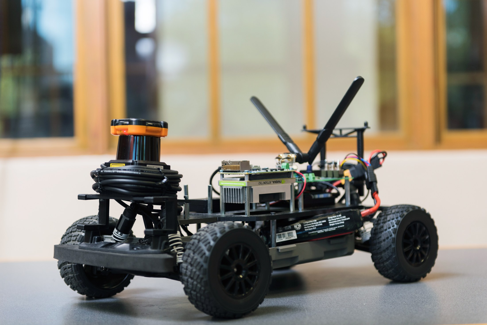
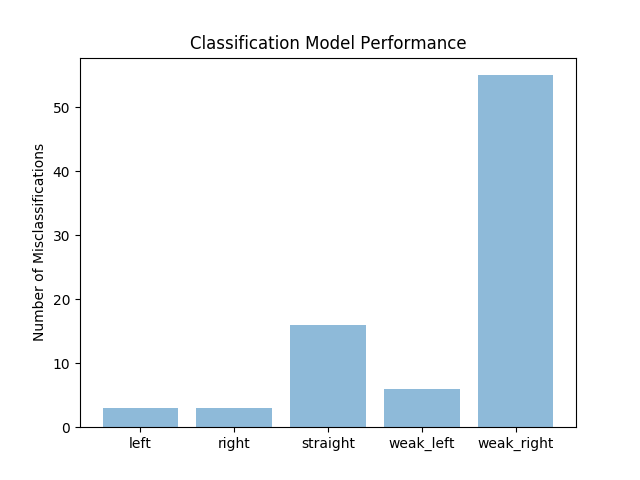
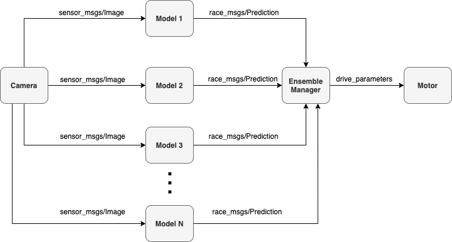

# Computer Vision 



**Photo Credit**: Hannah O'Leary, Oregon State University

Right now most things are limited to a single car. Multi-car experiments are a work in progress. 

## End-to-End Learning 

The current implementation is based on NVIDIA's DAVE-II Model.


**Data Collection:**

In three seperate terminals run the following:

 Terminal 1: 
 ```bash
 $ roslaunch race f1_tenth_devel.launch
 ```
 
 Terminal 2: 
 ```bash  
 $ rosrun computer_vision disparity_extender_vanderbilt.py
 ```
 
 Terminal 3: 
 
  ```bash  
 $ rosrun computer_vision synchronize_img_command.py
 ```
  
The synchronize_img_command performs the data collection. It collects the steering angles and logs the data into a directory which can be found in the data directory, categorized based on the degree of the turn. This categorization is used to train the classification model in the next section. The classes are left, right, weak_left, weak_right, straight. You can change the classes if you wish. Simply add more classes in the following [file](nodes/synchronize_img_command.py).

To access and view the data run: 
```bash
$ roscd computer_vision
```

I purposesly ignored the data directory for git tracking (It's very large). If you would like the data we used to train our models, I'm happy to provide it. Send me an email to obtain it.

**Training**

 You can tweak the hyperparameters in the following [file](training/train_daev_model.py).

```bash
$ roscd computer_vision/training 
$ python train_daev_model.py -d data/ -o models/{name_of_your_model}.hdf5
```

#### Evaluation

In two seperate terminals run the following:

To run an experiment where the model controls the car.

Terminal 1: 
```bash
$ roslaunch race f1_tenth_devel.launch
```
 
Terminal 2: 
```bash  
$ roscd computer_vision 
$ rosrun computer_vision ros_daev.py /racecar models/{name_of_your_model}.hdf5
```
To analyze the accuracy of your model. Instead of running the above in the second terminal. Run the following

Terminal 2: 
```bash  
$ roscd computer_vision/ 
$ rosrun computer_vision analyze_e2e.py /racecar models/{name_of_your_model}.hdf5 /vesc
```

Terminal 3: 
```bash  
$ rosrun race disparity_extender_vanderbilt.py
```
This will plot the error between the prediction from the neural network and ground truth (disparity extender).

You can also run the evaluation using the following launch. It assumes that your model is placed in the models directory within the [computer vision package](models). Simply specify your model name in the following [launch file](launch/end_to_end.launch) and run the following after launching f1_tenth_devel.launch:

```bash
  $ roslaunch computer_vision end_to_end.launch
```


## Classification Based Discrete Control

**Data Collection:** The data collection process is identical to the end-to-end scenario above. 

**Training**

You can select the architechture and hyperparameters in the following [file](training/train_classification_model.py). Simply add your architechture in the nn/conv directory appropriately.

Models that are currently available: 
- Mini VGGNET
- ShallowNet

To train a model run the following: 

```bash
$ roscd computer_vision/training 
$ python train_classification_model.py -d data/ -o models/{name_of_your_model}.hdf5
```

**Evalutation**

Similarly to the end-to-end driving scenario, there are two ways to evaluate the model. The first methods maps the classifications to discrete actions in order to control the car. The second method simply runs the classification model online and identifies misclassifications art runtime. Since the disparity extender was used to generate the training data, we can evaulate its performance with respect its operation. (Very open to suggestions on how to improve this)

To run Discrete Control experiments: 

Terminal 1: 
```bash
$ roslaunch race f1_tenth_devel.launch
```
 
Terminal 2: 
```bash  
$ roscd computer_vision 
$ rosrun computer_vision ros_classifier.py /racecar models/{name_of_your_model}.hdf5
```
The discrete control actions are defined in the following [file](nodes/ros_classifier.py). Feel free to tweak them for your experiments.

In a similar vein to the end-to-end learning experiments. You can analyze how well your classification system adheres to the ground truth classifications generated by either the disparity extender or the potential field controller.

To analyze the accuracy of your model. Instead of running the above in the second terminal. Run the following:

Terminal 2: 
```bash  
$ roscd computer_vision 
$ rosrun computer_vision analyze_classification_model.py /racecar models/{name_of_your_model}.hdf5 /vesc
```

Terminal 3: 
```bash  
$ rosrun race disparity_extender_vanderbilt.py
```

This will plot a box plot with the number of detections labeled as misclassifications.



To run the end-to-end simulation:

```bash
  roscd && cd ..
$ docker-compose -f end_to_end.yml up
```

To teleoperate the car or run experiments run the following:

```bash
$ docker container exec -it keyboard bash 
```

Then run: 
```bash 
$ source devel/setup.bash && rosrun race keyboard.py
```

To run the end-to-end simulation:

```bash
$ roscd && cd ..
$ docker-compose -f end_to_end.yml up
```

# End-to End Driving via Ensemble Based Classification 

The training process of neural networks is challenging and in some cases it can fail. This can mean that the model at the end of training may not be stable or the best-peforming set of weights. One way to deal with this challenge is to use ensemble methods which refers to training a "large number of modles and then combining their output predictions via voting or averaging. The other method of combining several methds is to use an average of the weights of multiple models to create a new model, this form of combining methods is called Polyak-Ruppert Averaging. A discussion of these techniques can be found in the following [tutorial](https://machinelearningmastery.com/polyak-neural-network-model-weight-ensemble/) by Dr. Jason Brownlee.

## Training 

Before we can use an ensemble of neural networks to make predictions. We must first make the ensemble. The file to train the ensemble can be found [here](training/train_ensemble_classifer.py). The syntax to train ensembles is given by: 

```
python train_ensemble_classifier.py [-h] -d DATASET -o OUTPUT -l LOGS [-n NUM_MODELS]
   optional arguments:
	-h, --help show this help message and exit
	-d DATASET, --dataset DATASET path to input dataset
	-o OUTPUT, --output OUTPUT directory where we will output the model
	-l LOGS, --logs LOGS directory where we will output the plots and accuracy reports
	-n NUM_MODELS, --num-models NUM_MODELS # of models to train  
```

Example: 

``` bash
$ roscd computer_vision/training  
$ python train_ensemble_classifer.py -d data/ -o output/ -l logs/
```

The default is to train 5 models but you can change that with -n flag.


## Combining Predictions Using Averaging

The first method I investigate for evaluating ensemble methods on the F1Tenth platform is inspired by [Dr. Adrian Rosebrock](https://www.pyimagesearch.com/author/adrian/). The idea here is that we create several ros nodes that make predictions on images received from the camera mounted on the car. Each model makes a prediction based on that image into 5 classes (left, weak left, straight, weak right, right) and then that prediction is sent to a ensemble manager. The ensemble manager then takes each of the prediction logits and averages them. This can be done in multiple ways but the default is to use a simple average. Based on that average the ensemble manager assigns the prediction to the highest value in the average logit. The architechture is shown below.



To run this demonstration run the following:

Terminal 1:

```
$ roslaunch race f1_tenth_devel.launch
```

Each node must be named in order for the ensemble manager to properly synchronize the messages. The name is the last parameter passed to the following commands. Each node gets its own terminal. Alternatively, you can create a launch file. The first parameter is the name of the racecar. This specifies which camera to subscribe to, if there are multiple.

Terminal 2-N:

```
$ roscd computer_vision 
$ rosrun race computer_vision ros_ensemble.py /racecar models/minivgg_3.hdf5 model_name
```

The names of each model are then passed to the ensemble manager.

Terminal N+1:

```
$ roscd computer_vision 
$ rosrun race computer_vision ensemble_manager.py /racecar model_1 .... model_n
```

## Creating a new model using Polyak-Ruppert Averaging 

Working on this. Will be done by 4/10/2020.


