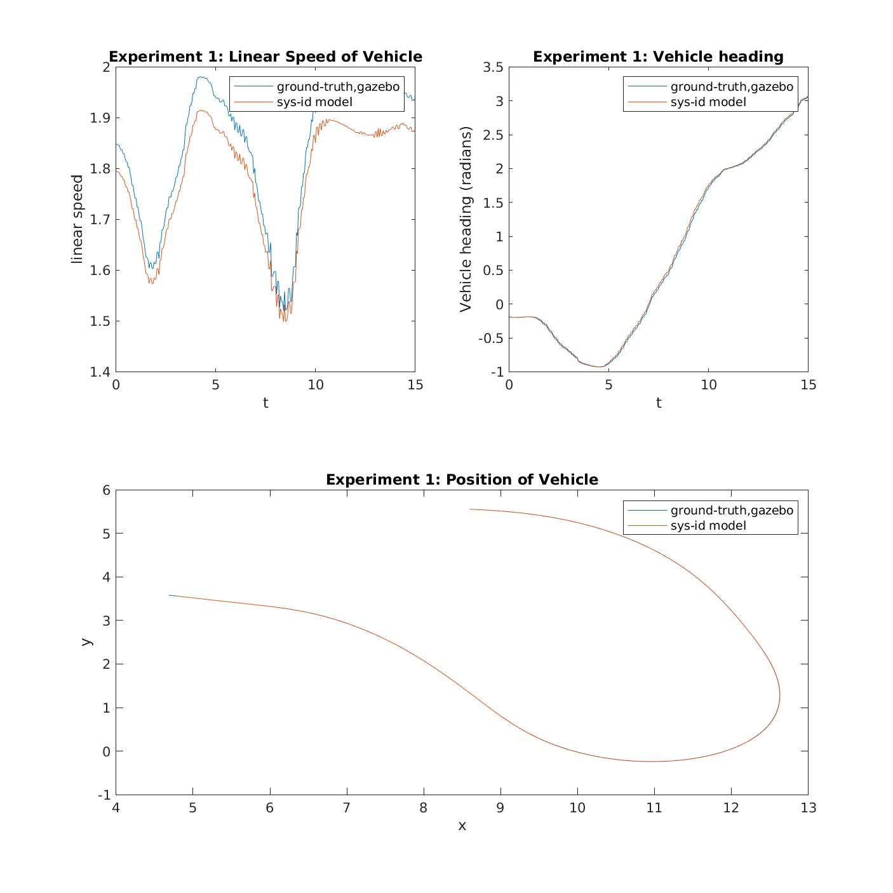

# System Identification for F1Tenth Simulation Model 

In the following section we focus on the problem of building a mathematical model of the F1Tenth vehicle that appears in this simulator. The model is constructed from measured data collected in various experimental runs using the following [launch file](https://github.com/pmusau17/Platooning-F1Tenth/blob/master/src/race/launch/sys_id.launch). The results of these experiments are contained in the [csv](csv) directory.  

Using this data we use a kinematic bicycle model to describe the car's dynamics. The bicycle model is a [standard model for cars](https://github.com/pmusau17/Platooning-F1Tenth/blob/master/src/race/sys_id/bicycle_model.m) and our task is to identify parameters within this model to describe the F1Tenth simulation vehicle. The model has few parameters and has been shown to perfom wll and low speeds, as stated by [Ivanov et al](https://arxiv.org/pdf/1910.11309.pdf). This form of system identification is known as grey box modeling since we combine a model with data to complete the model.

Once the parameters have been obtained, simply edit the file simulate_bicycle_euler with the new parameters and then run the file [validate_experiment.m](validate_experiment.m) to do model validation. This script will produce a series of plots for each experiment, such as the one below, in the [plots](plots) directory. 

So far the best parameters, we've found for this model are:
```
ca = 1.9569, cm = 0.0342, ch = -37.1967, lf = 0.225, lr = 0.225
```



