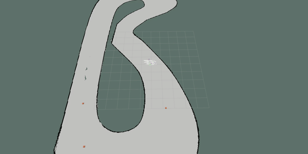

# F1Tenth Rtreach


# Table of Contents

1. [Introduction](#introduction)
2. [Multi-Agent Reachability](#MultiAgent)
3. [Repositiory Organization](#CodeDescrip)

### Real Time Reachability for the F1Tenth Platform  <a name="introduction"></a>

This repo is an implementation of a runtime assurance approach by [Stanley Bak et al.](https://ieeexplore.ieee.org/document/7010482) for the F1Tenth platform. The motivation for runtime assurance stems from the ever-increasing complexity of software needed to control autonomous systems, and the need for these systems to be certified for safety and correctness. Thus the methods contained herein are used to build monitors for the system that can be used to ensure that the system remains within a safe operating mode. As an example, in the following animations we display a system with an unsafe neural network inspired controller that occasionally causes the f1tenth model to crash into walls. In the second animation, we add a real time safety monitor that switches to a safe controller when it detects a potential collision. Though the safety controller sacrifices performance it ensures that we do not collide with obstacles. The safety monitor was designed using the algorithms described by Bak et al. 


#### Neural Network Only (LEC)


#### Neural Network + Monitor + Safety Controller


**Disclaimer**: Our assumption is that you are using linux. A major part of this effort involves ROS. This code was tested on a computer running Ubuntu 16.04.6 LTS.

### Intro to rtreach: Let's start with an example.
<hr /> 

The safey monitor implemented in this repository relies on an anytime real-time reachability algorithm based on [mixed face-lifting](http://www.taylortjohnson.com/research/bak2014rtss.pdf). The reach-sets obtained using this method are represented as hyper-rectangles and we utilize these reachsets to check for collisons with obstacles in the vehicle's environment. The following example shows the use of this algorithm to check whether the vehicle will enter an unsafe operating mode in the next one second using the current control command. 

<hr /> 

The platform that we seek to use these techniques on is a 1/10 scale autonomous race car named the [F1Tenth](https://f1tenth.org/). The platform was inspired as an international competition for researchers, engineers, and autonomous systems enthusiasts originally founded ath University of Pennsylvania in 2016. 

<!-- Our initial implmentation is done in simulation but we are also planning on doing this on the hardware platform. Thus, This assumes that you have the F1Tenth Simulator installed. If not please install it by following the instructions available [here](https://github.com/pmusau17/Platooning-F1Tenth). -->

### Running Rtreach
<hr /> 

Start the simulation. This will bring up the track displayed at the start of this readme and a green model of a simplistic autonomous vehicle. 

```
$ roslaunch race sim_for_rtreach.launch 
```

The neural network inspired controller that we use in our experiments maps images captured from the vehicle's camera into one of five discrete actions (turn left, turn right, continue straight, turn weakly left, turn weakly right). The network model used to make inferences is [VGG-7](https://towardsdatascience.com/only-numpy-implementing-mini-vgg-vgg-7-and-softmax-layer-with-interactive-code-8994719bcca8). The safe controller is a gap following algorithm that we select because of its ability to avoid obstacles. 


Run the safety monitor + safety_controller + neural network controller. 

```
$ rosrun rtreach reach_node porto_obstacles.txt
```
In this setup the decision manager will allow the neural network model to control the vehicle so long as the control command issue will not cause the vehicle to enter an unsafe state in the next one second. Otherwise the safety controller will be used. The decision manager can then return to the neural network controller provided that the car has been in a safe operating mode for 20 control steps. 


To select a different set of weights for the neural network, you can specify the model .hdf5 in the [rtreach.launch](https://github.com/pmusau17/Platooning-F1Tenth/blob/master/src/race/launch/rtreach.launch) file. The available .hdf5 files are listed in the following [directory](https://github.com/pmusau17/Platooning-F1Tenth/tree/master/src/computer_vision/models). You are also free to train your own!

Arguments that can be provided to the [sim_for_rtreach launch file](https://github.com/pmusau17/Platooning-F1Tenth/blob/master/src/race/launch/sim_for_rtreach.launch): 
- world_name: gazebo world file used to generate environment.
- model_name: network .hdf5 keras model file. 
- csv_filename: waypoint file used by pure pursuit algorithm.
- lec_only: flag that limits experiment to LEC only control.
- map_file: occupancy grid for corresponding world name. 
- random_seed: random seed used to allocte obstacles within vehicle environment.
- freespace_file: free space points within occupancy grid this file is generate by [gen_map.py](https://github.com/pmusau17/Platooning-F1Tenth/blob/master/src/race/scripts/gen_map.py)
- timeout: how long to run each experiment before timeout.

Example specification of argument parameter: **argument_name:=value** 

```
$ roslaunch race sim_for_rtreach.launch timeout:=10 
```

### Visualizing the Reachable Set
<hr /> 

You can visualize the reachable set by running the following: 

```
$ rosrun rtreach visualize_node porto_obstacles.txt 1 2.0 10
```

Usage: 

```
$ rosrun rtreach visualize_node (file containing obstacle locations) (boolean for bloating of reachset) (reachset time horizon) (reachability wall time)
```




### Run Benchmarking Series of Experiments
<hr /> 

One of the things that may be useful to do is to run a series of simulations with a diverse number of obstacle placements for a given track. Then one can monitor how effective the safety controller under consideration is. We have made this functionality available. The bash script [run_batch.sh](run_batch.sh) performs several experiments with a timeout of 60 seconds and randomly places obstacles within the racetrack.

To use the script first source both the rtreach and Platooning-F1Tenth packages and then run the bash file:

#### End-to-End Controller Experiments 
```
$ source rtreach_ros/devel/setup.bash
$ source Platooning-F1Tenth/devel/setup.bash
$ ./run_batch.sh
```

#### Reinforcement Learning Experiments
```
$ source rtreach_ros/devel/setup.bash
$ source Platooning-F1Tenth/devel/setup.bash
$ ./run_batch_rl.sh
```

If a collision occurs during any of the experiments it will be logged along with the random_seed, and number of obstacles so that the scenario can be re-produced. The logs can be found in the following [directory](https://github.com/pmusau17/Platooning-F1Tenth/blob/master/src/race/logs).


### Computing Reachsets for Dynamic Obstacles
<hr /> 

The obstacle tracking problem is a well studied and challenging topic within the autonomous vehicle, computer vision, and robotics literature. 
Typically some assumptions are required in order to constrain the tracking problem to best suit the context of the application. In our framework we assumed that the obstacles could be described a two dimensional kinematic model and a corresponding bounding box. The code below implements reachability using this model

```
$ gcc -std=gnu99 -Wall face_lift_obstacle.c geometry.c interval.c util.c  simulate_obstacle.c dynamics_obstacle.c main_obstacle.c obstacle_model.c -lm -o obstacle -DOBSTACLE_MODEL
```

```
./obstacle 10 0 0 1.0 0.0
```

### Obstacle Visualization
<hr /> 

To visualize the reachsets using a two-dimensional kinematic model: 

```
$ gcc -std=gnu99 -Wall face_lift_obstacle_visualization.c geometry.c interval.c util.c  simulate_obstacle.c  dynamics_obstacle.c  main_obstacle_vis.c obstacle_model_plots.c -lm -o obstacle_plot -DOBSTACLE_MODEL
```

```
./obstacle_plot 5 0 0 1.0 0.1
```

### Using the kinematic model within the simulator. 
<hr /> 

As an example, if we assume that the F1Tenth model can be described by a two-dimensional kinematic model, then the reachability analysis code takes the following form: 

In two seperate terminals run the following: 

**Make sure to source PlatooningF1Tenth/devel/setup.bash**

Terminal 1:
```
roslaunch race sim_for_rtreach.launch
```

**Make sure to source rtreach_ros/devel/setup.bash**

Terminal 2: 
```
rosrun rtreach visualize_obs racecar 1.0 2.0 100
```


# Multi-Agent Reachability<a name="MultiAgent"></a>


To enable reachability regimes within the context of dynamic obstacles and multiple agents we need a way to send the hyper-rectangles on the ROS network. Additionally we need to set an upper limit on the number of hyper-rectangles used to represent the reachable set. This is what the following code implements.

To launch such a simulation run the following

```
$ source rtreach_ros/devel/setup.bash
$ source Platooning-F1Tenth/devel/setup.bash
$ roslaunch race sim_for_rtreach_multi_agent.launch
```

### Multi-agent nodes

```
rosrun rtreach reach_node_dyn 1.0 2.0 100 1
rosrun rtreach vis_node_param 1.0 2.0 100 1
```

# Repository Organization <a name="CodeDescrip"></a>
**ros_src/rtreach:** ros-package containing rtreach implementation.
- [reach_node_sync.cpp](ros_src/rtreach/src/reach_node_sync.cpp): ROS-node implementation of safety monitor and controller. 
- [visualize_reachset.cpp](ros_src/rtreach/src/visualize_reachset.cpp): ROS-node for visualization of hyper-rectangles.

**src:** C-implementation of rtreach.
- [dynamics_bicycle_model.c](src/dynamics_bicycle_model.c): Interval arithmetic implementation of a kinematic bicycle model for a car. Parameters are identified using [grey-box system identification](https://github.com/pmusau17/Platooning-F1Tenth/tree/master/src/race/sys_id).
- [interval.c](src/interval.c): Implementation of interval arithmetic methods.
- [geometry.c](src/geometry.c): Implementation of hyper-rectangle methods.
- [face_lift_bicycle_model.c](src/face_lift_bicycle_model.c): Facelifting method implementation with bicycle model dynamics.
- [bicycle_safety.c](src/bicycle_safety.c): Implementation of safety checking for the f1tenth model. Current checking includes static obstacles and collisions with walls.
- [simulate_bicycle.c](src/simulate_bicycle.c): Implementation of Euler simulation of kinematic bicycle model. 
- [simulate_bicycle_plots.c](src/simulate_bicycle_plots.c): Implementation of methods for plotting for reach sets.
- [bicycle_model.c](src/bicycle_model.c): Implementation of safety checking for f1tenth platform, makes use of the facelifting algorithms in [face_lift_bicycle_model.c](src/face_lift_bicycle_model.c).
- [bicycle_model_plots.c](src/bicycle_model_plots.c): Same as above but intented for plotting purposes.
- [util.c](src/util.c): Helper functions for timing and printing. 


